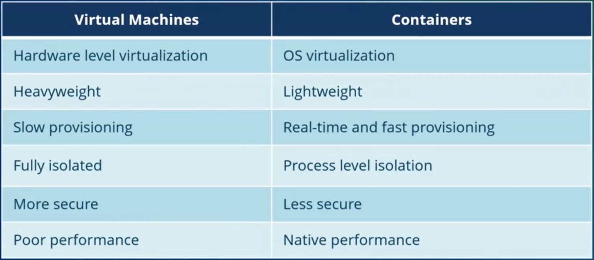
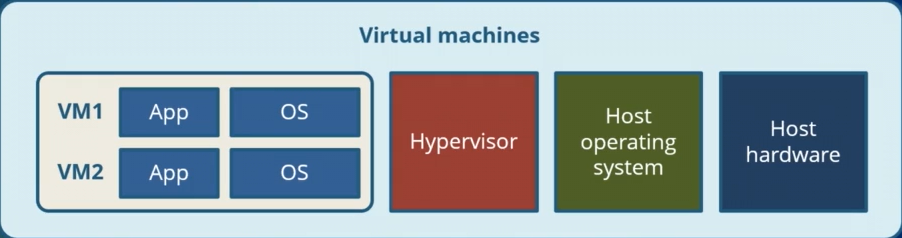
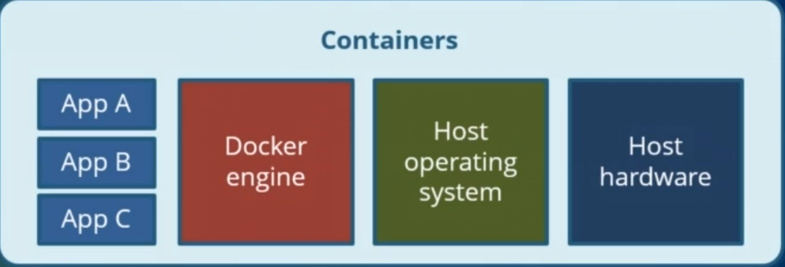

# Table of Content

- [Containerization](#containerization-and-docker)
  - [Virtual Machines vs Containers](#comparing-containers-vs-virtual-machines)
  - [Architecture Differences](#architecture-differences)

<!-- markdownlint-disable MD025 -->

# Containerization and Docker

## Containerization

A lightweight alternative to virtual machine. It involves encapsulating an application in a container with its own OS. Containerization uses Linux container.
It shares the same kernel as the host machine.

## Comparing Containers vs Virtual Machines

<!-- markdownlint-disable MD033 -->

### Architecture Differences

  
  
