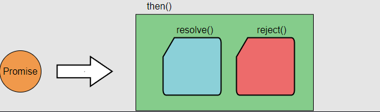

# Rx Basics

- [Rx Basics](#rx-basics)
  - [Intro](#intro)
  - [Variables](#variables)
  - [Array](#array)
  - [Promise](#promise)
  - [TypeScript promise](#typescript-promise)

## Intro

Here we will look at some basic Rx concepts like variables, arrays, promises, and observables.

## Variables

Example of a **variable**:

```JS
let myVar = 42;
console.log(myVar);
```

As you probably know, a variable contains a single value, and that value can be used immediately after declaration. Variables are pretty simple. On the other had we have arrays.

## Array

Example of an **array**:

```JS
//Array represents a collection of values
let myArr = [42, 'Hello World', NaN];
console.log(myArr);
```

This array represents a collection values. Like the humble variable, an array also contains its data at the moment of creation.

## Promise

If all programming just used the above two concepts, life would be pretty easy. Everything needed to run a program would be immediately available when the program started.

Unfortunately, there are times when the data the program needs isn't immediately available. For instance, a web page might need to make an AJAX request to get information about the current user:

```JS
let user = getUserFromAPI();
doSomething(user);
```

Running this code results in a fireball of cataclysmic proportions or a stack trace. Either is likely through, it's probably the stack trace. In any case, it doesn't get our data because the request has been made to the backend but hasn't finished yet. Hence, `doSomething(user)` will cause an error.

One possible solution to this problem is to stop the entire process and do nothing until the AJAX request returns.

Let's look at an example. This is silly.

---

If my wife asks me to unload the groceries when she returns from the store, the proper answer is not to sit absolutely still on the couch until she arrives. Instead, I make a mental note that I have a task to do some time in the future. The JavaScript version of this mental note is called a **promise**.

---

This is an example of a promise.

```JS
let userRequest = getUserFromAPI();
```

Like a variable, `userRequest` contains a single value, but it doesn't immediately have that value. A promise represents data that has been requested but isn't there yet.
To do anything with that data, we need to unwrap the promise using the `.then` method:

```JS
let userRequest = getUserFromAPI();
userRequest.then(userData => {
    //called when the request returns
    processUser(userData);
})
```

> Acting as **"mental node"**, a promise allows the core process to go on doing things elsewhere while the backend rustles through various database indexes looking for our user.
> Once the request returns, our process peeks inside the `.then` to see what to do, executing whatever function we passed in.

## TypeScript promise

A promise accepts a **callback** function as a parameter. THe callback function accepts 2 parameters, `resolve` and `reject`. If the task is successfully performed, then it returns `resolved`.
Else it returns the `reject`.

This is how a promise in typescript looks like:

```typescript
const promise = new Promise(function(resolve, reject){});
```

<!-- markdownlint-disable -->
<p align="center">
    
    <p align="center">
    <code>Promise and then() call</code>
    </p>
</p>
<!-- markdownlint-enable -->

